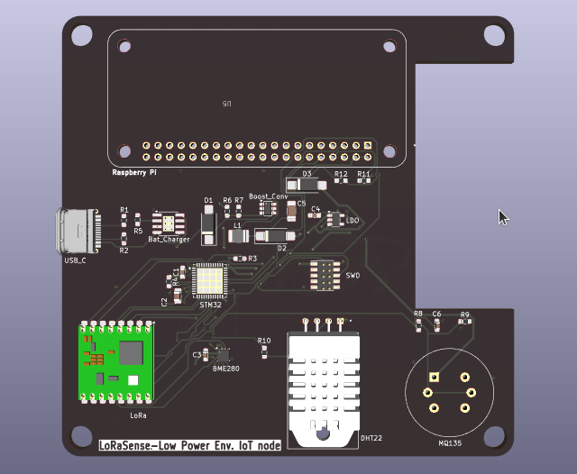
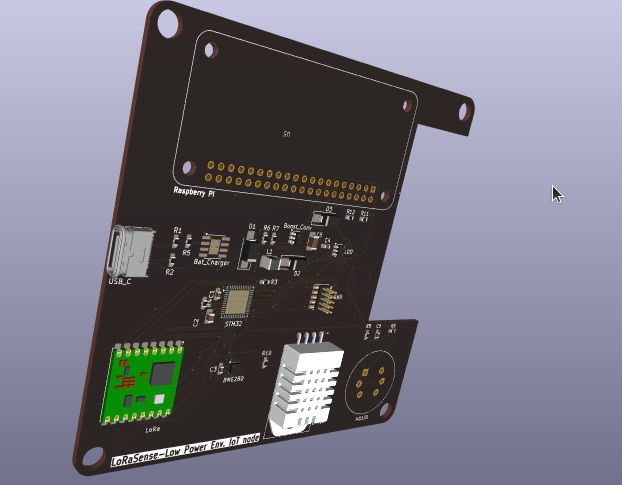
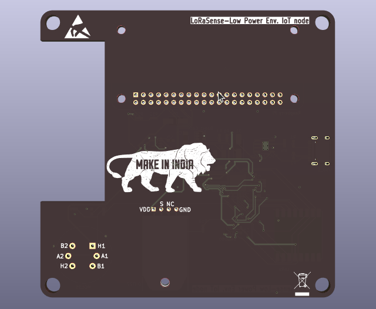

# StellarSat ClimateSense - 1U CubeSat OBC

StellarSat ClimateSense is a 1U CubeSat mission focused on monitoring climate variations and atmospheric parameters from Low Earth Orbit (LEO).

## Mission Objective
To measure temperature, humidity, pressure, and air quality parameters and transmit data to a simulated ground station.

## System Architecture

### On-Board Computer (OBC)
- STM32 Microcontroller (Low-level control & sensor handling)
- Raspberry Pi Zero 2W (Data processing & formatting)

### Sensors
- BME280 – Temperature, Humidity & Pressure
- MQ-135 – Air Quality / CO₂ / NH₃
- DHT22 – Backup Temperature & Humidity

### Communication
- LoRa / RF simulation module
- Data formatted and transmitted to simulated ground station

## Simulation & Validation
- Proteus
- MATLAB
- OnShape

## 3D PCB View

### Top View

### Isometric View

### Bottom View

## 👤 Author

Designed and developed by Harshini  
Embedded Systems & PCB Design Enthusiast
